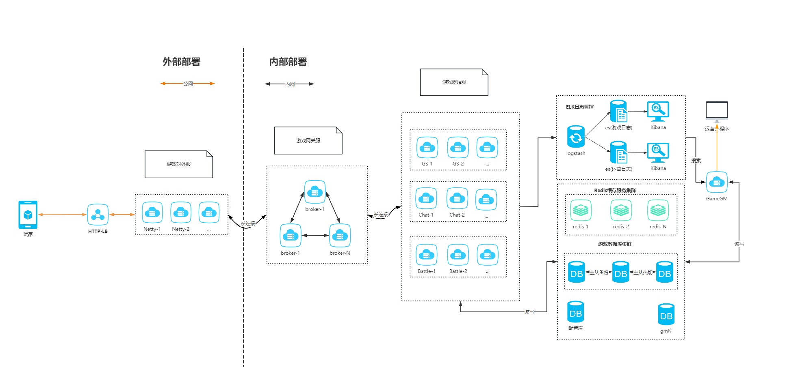

# 项目结构

```
.
├── L3Game
├── backend                                         # 后端服务
│   ├── excel                                       # 策划表和数据        
│   ├── framework                                   # 业务数据库和redis缓存框架(暂定)    
│   ├── jproto                                      # 前后端通信数据协议
│   └── server                                      # 逻辑业务模块 
├── common                                          #后端服务
│   ├── common-core                                 # 业务框架
│   ├── common-game                                 # 业务通用工具类        
│   ├── common-kit                                  # 业务框架      
│   ├── common-micro-kit                            # 游戏部件 : 进一步减少开发实践过程中的工作量  
│   └── common-validation                           # 数据校验模块
├── tools                                           # 工具类
│   ├── client                                      # 压测&模拟客户端请求
│   ├── createsql                                   # 生成多库多表sql工具
│   ├── jprotobuf                                   # jprotobuf转换成proto文件
│   └── jexcel                                      # 策划表数据转换成java表结构和数据
└── pom.xml                                         # 整体 maven 项目使用的 pom 文件
```

# 配置开发环境

### 后端

后端使用了 Java 语言的 Spring Boot 框架，并使用 Maven 作为项目管理工具。开发者需要先在开发环境中安装 JDK 17 及 Maven。

#### 编码风格与辅助
遵循[阿里巴巴Java开发手册规约在线文档](https://kangroo.gitee.io/ajcg/#/)

#### 架构


#### 配置server服务启动参数：
-DpropsConfig=D:/liulongling/work/github/L3Game/config/dev -DcommonLogPath=D:/liulongling/Log -Dlogback.configurationFile=D:/liulongling/work/github/L3Game/config/dev/common/logback.xml